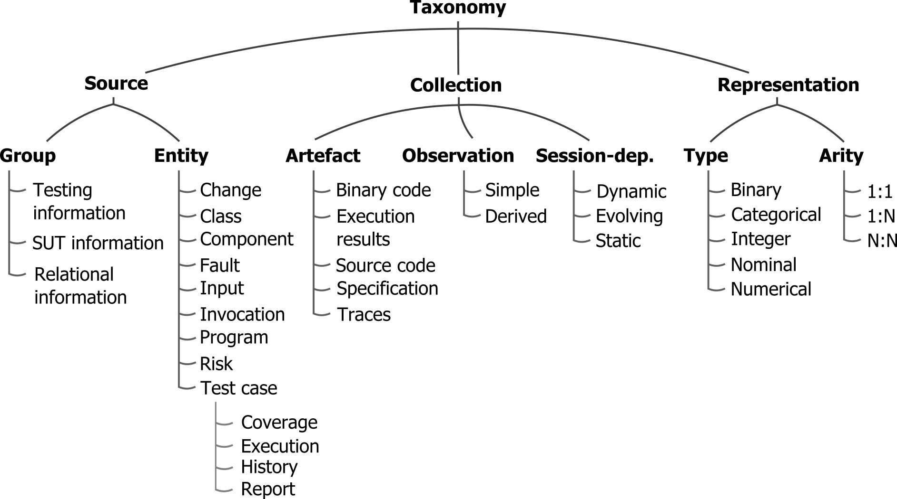

# Taxonomy definition

## Description

In this folder you can navigate through the three dimensions of the TePIA taxonomy. For each dimension, you will find a short description and its categories. For each category, you will see available options and the corresponding list of attributes. You can click on any attribute to access to its description, rest of characteristics and supporting references.

* [Dimension 1: Source](source/README.md)
* [Dimension 2: Collection](collection/README.md)
* [Dimension 3: Representation](representation/README.md)

